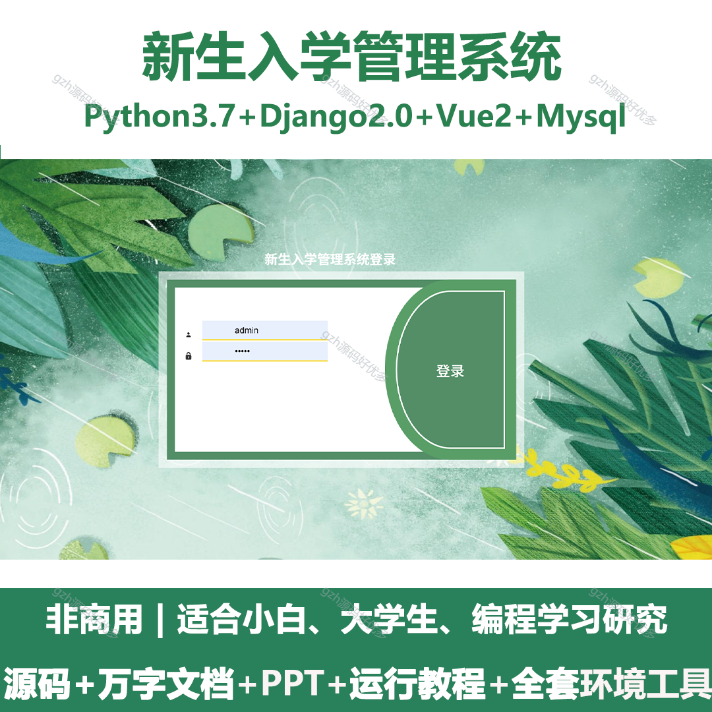
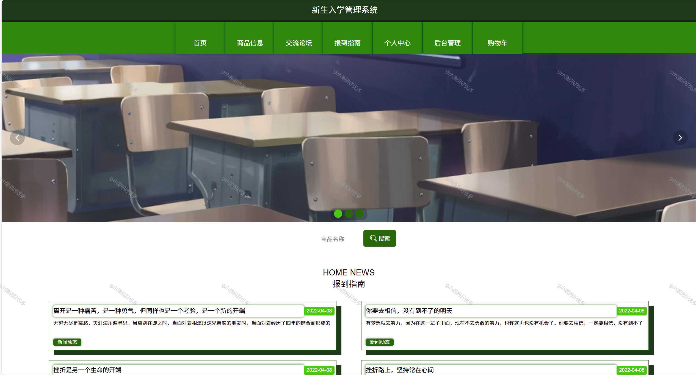
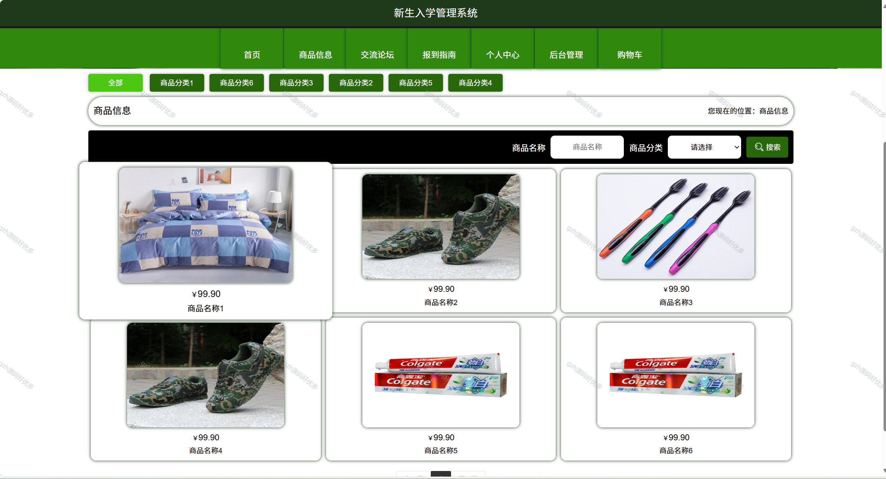
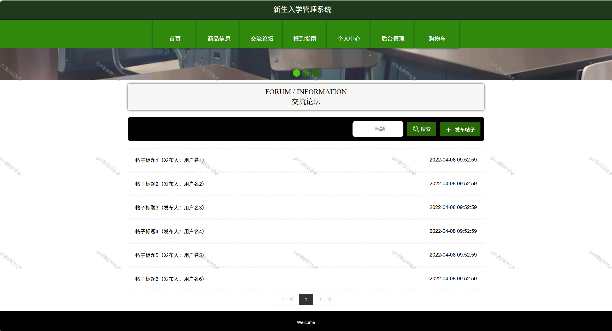
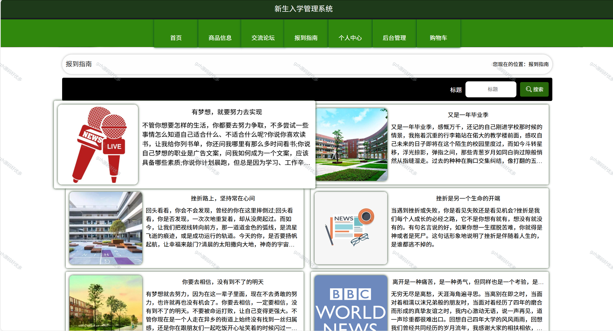
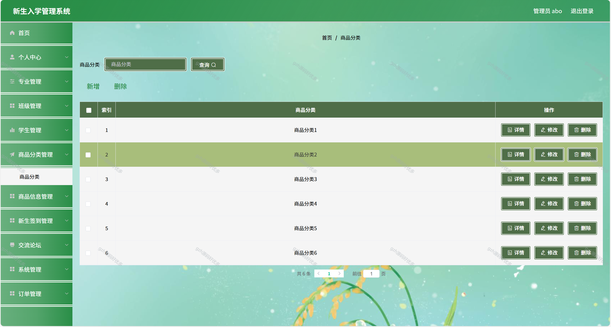
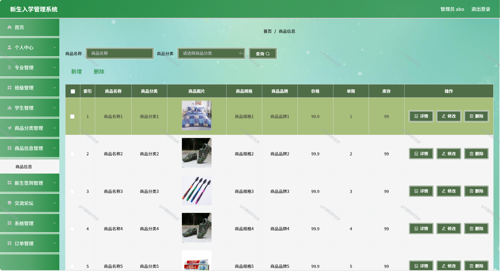
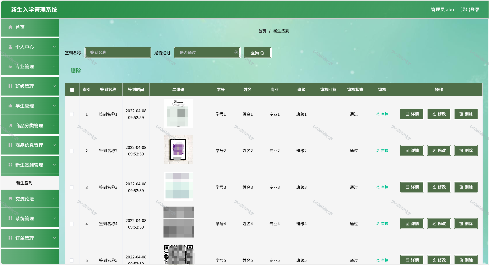
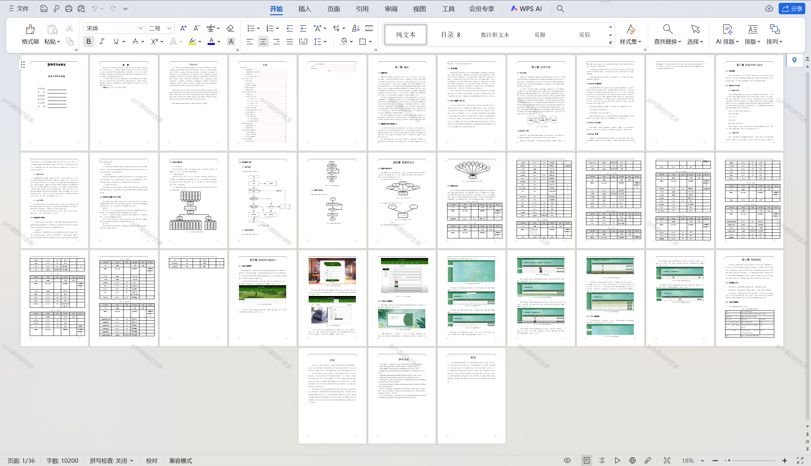

# python057
python057基于Python+Django的新生入学管理系统+LW+PPT（Layui）
 
## 查看主页获取源码

### 一、关键词
新生报到管理系统，新生入学手续办理系统，新生入学管理信息系统

### 二、作品包含
源码+数据库+万字文档+PPT+全套环境和工具资源+本地部署教程

### 三、项目技术
前端技术：Vue2.0、Element-ui、Layui
后端技术：Python3.7、Django2.0

### 四、运行环境（以下版本亲测，其他版本未知，请自测）
开发工具：PyCharm + VSCODE

数据库：MySQL5.7（最低要5.7版本）

数据库管理工具：Navicat10+

Python：Python3.7

前端Nodejs：14

浏览器：谷歌浏览器

### 五、项目介绍
项目编号：python057

设计的内容是设计并且实现一个基于Python技术的新生入学管理系统。它是在Windows下，以MYSQL为数据库开发平台和Python技术进行开发实现。新生入学管理系统的功能已基本实现，主要实现首页，个人中心，专业管理，班级管理，学生管理，商品分类管理，商品信息管理，新生签到管理，交流论坛，系统管理，订单管理等功能的操作系统。

### 六、运行截图

